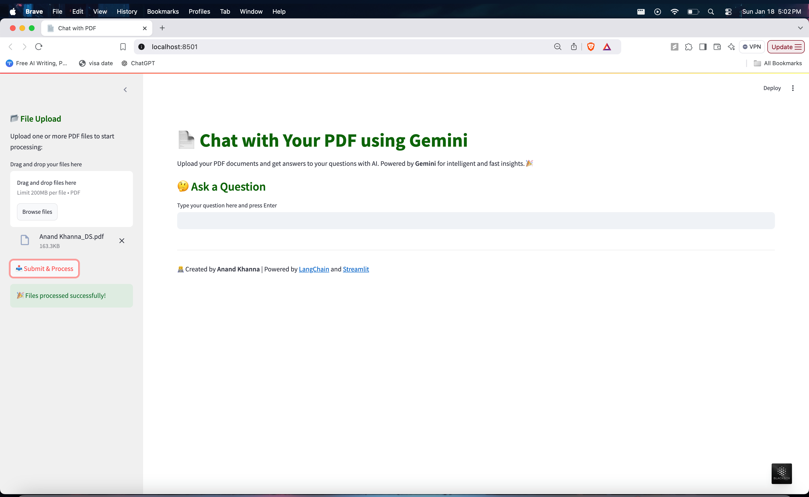

# 📄 Chat with PDF using Gemini

## 📖 Overview

This project provides a **PDF-based conversational AI tool** powered by **Google's Gemini AI**. The application allows users to upload PDF files and interact with the content through intelligent question-answering, leveraging **LangChain**, **FAISS**, and **Google Generative AI** embeddings.

With an intuitive interface built using **Streamlit**, users can upload PDFs, process text, and receive accurate and context-aware answers to their questions. The tool is designed to streamline document interactions, making it easier to retrieve specific information efficiently.

---

## 📋 Features

- **PDF Upload**: Drag and drop multiple PDF files for processing.
- **AI-Powered QA**: Use Google Gemini AI for accurate question-answering.
- **Contextual Search**: Retrieves answers based on the content of uploaded PDFs.
- **Efficient Text Splitting**: Uses LangChain’s `RecursiveCharacterTextSplitter` for optimal processing.
- **Dynamic Vector Store**: Creates and updates FAISS-based vector embeddings for efficient search.
- **Responsive UI**: Aesthetic and user-friendly interface built with **Streamlit**.

---

## 🚀 Getting Started

### Prerequisites

1. **Python 3.8+** installed on your system.

## 🛠️ Usage

1. **Upload PDFs**: Drag and drop one or more PDF files in the sidebar.
2. **Ask Questions**: Enter your question in the input box and hit Enter.
3. **Get Answers**: The tool processes the PDF content and provides relevant answers.

---

## 📖 How It Works

1. **PDF Text Extraction**: Reads content from uploaded PDFs using `PyPDF2`.
2. **Text Chunking**: Splits the extracted text into manageable chunks for better processing.
3. **Vector Store Creation**: Embeds text chunks using **Google Generative AI Embeddings** and stores them in a **FAISS** index.
4. **Question-Answering**:
   - Searches for the most relevant chunks using similarity search.
   - Passes the context and query to **Google Gemini AI** for detailed responses.

---

## 🖼️ Screenshots

### User Interface

### File Upload

### Answer Display

---

## 🛡️ Technologies Used

- **Streamlit**: Interactive and responsive user interface.
- **LangChain**: Advanced text chunking and QA pipelines.
- **Google Gemini AI**: State-of-the-art language model for embeddings and chat.
- **FAISS**: High-performance similarity search for vector embeddings.
- **PyPDF2**: PDF text extraction.
